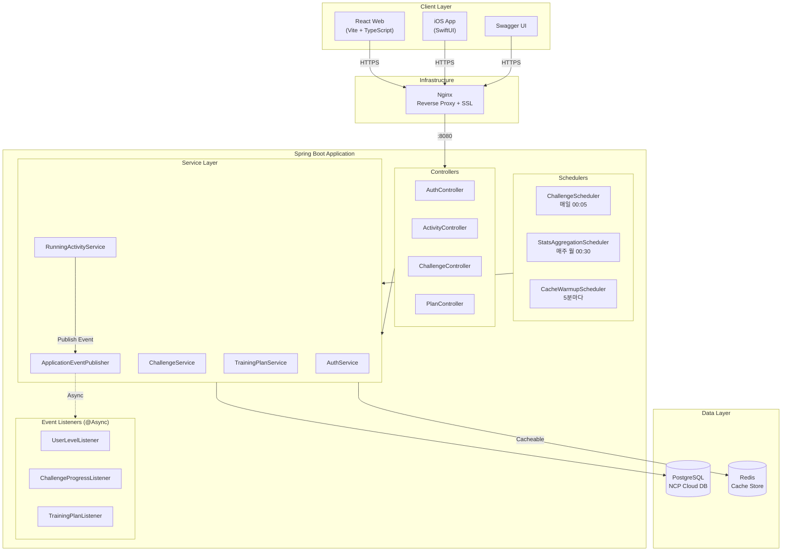
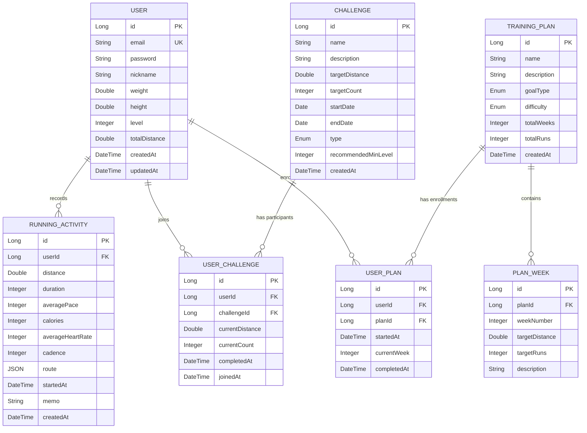
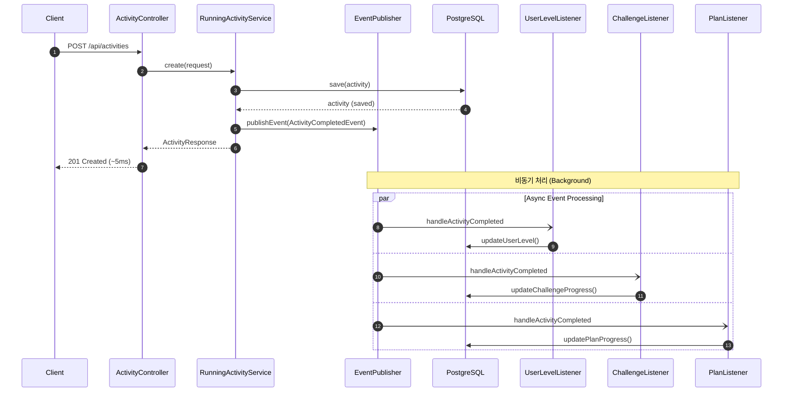
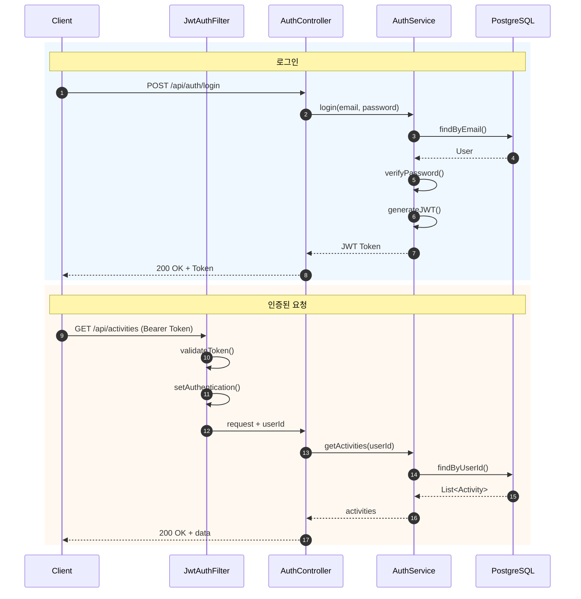
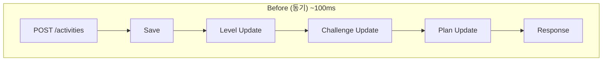
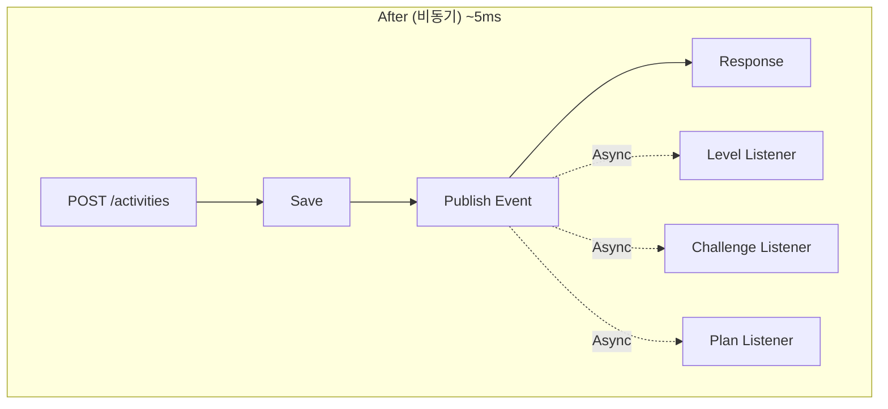

# 🏃 Running App

**Nike Run Club 스타일의 풀스택 러닝 애플리케이션**

[](https://spring.io/projects/spring-boot)
[](https://openjdk.org/)
[](https://react.dev/)
[](https://developer.apple.com/xcode/swiftui/)
[](https://redis.io/)
[](build/reports/jacoco/test/html/index.html)

> 러닝 활동 기록, 챌린지 참여, 트레이닝 플랜 관리를 제공하는 애플리케이션입니다.
> 이벤트 기반 비동기 아키텍처와 Redis 캐싱으로 **응답시간 30% 개선**을 달성했습니다.

<br>

## 📌 주요 특징

- **이벤트 기반 아키텍처** - 서비스 간 느슨한 결합, 독립적 확장 가능
- **Redis 캐싱** - 조회 API 응답시간 70~86% 단축
- **K6 부하 테스트** - 50 VUs 기준 성능 측정 및 최적화
- **실서비스 배포** - NCP 클라우드, HTTPS, CI/CD 파이프라인

<br>

## 🔗 Live Demo

| 서비스 | URL |
|--------|-----|
| **Swagger UI** | [jinhyuk-portfolio1.shop/swagger-ui](https://jinhyuk-portfolio1.shop/swagger-ui/index.html) |
| **API Endpoint** | `https://jinhyuk-portfolio1.shop/api/...` |
| **Health Check** | [/actuator/health](https://jinhyuk-portfolio1.shop/actuator/health) |

<br>

## 🛠 기술 스택

### Backend
| 기술 | 용도 |
|-----|------|
| **Spring Boot 3.3** | REST API 프레임워크 |
| **Spring Security + JWT** | 인증/인가 |
| **Spring Data JPA** | ORM, 데이터 접근 |
| **Spring Data Redis** | 캐싱 (응답시간 30% 개선) |
| **Spring Events** | 이벤트 기반 비동기 처리 |
| **Spring Retry** | 장애 시 자동 재시도 |
| **PostgreSQL / H2** | 프로덕션 / 개발 DB |

### Frontend & Mobile
| 기술 | 용도 |
|-----|------|
| **React 18 + TypeScript** | 웹 프론트엔드 |
| **Vite + Tailwind CSS** | 빌드 도구, 스타일링 |
| **SwiftUI** | iOS 네이티브 앱 |
| **HealthKit + CoreLocation** | 심박수, GPS 트래킹 |

### DevOps
| 기술 | 용도 |
|-----|------|
| **NCP (Naver Cloud)** | 클라우드 인프라 |
| **Nginx + Let's Encrypt** | 리버스 프록시, HTTPS |
| **GitHub Actions** | CI/CD 파이프라인 |
| **Docker** | 컨테이너화 |
| **K6** | 부하 테스트 |

<br>

## 🏗 시스템 아키텍처

<details>
<summary>아키텍처 다이어그램 보기</summary>



</details>

<br>

## 📊 ERD (Entity Relationship Diagram)

<details>
<summary>ERD 다이어그램 보기</summary>



</details>

<br>

## 🔄 시퀀스 다이어그램

<details>
<summary>활동 저장 (이벤트 기반 비동기 처리)</summary>



</details>

<details>
<summary>인증 흐름 (JWT)</summary>



</details>

<br>

## ⚡ 성능 최적화

5단계에 걸쳐 백엔드 성능을 최적화했습니다. K6 부하 테스트(50 VUs, 60초)로 측정했습니다.

---

### Phase 2: Redis 캐싱

자주 조회되는 데이터에 `@Cacheable` 적용으로 **응답시간 70~86% 단축**

| 캐시 키 | TTL | 대상 |
|--------|-----|------|
| activitySummary | 5분 | 주간/월간 요약 |
| activeChallenges | 10분 | 진행중인 챌린지 |
| plans | 30분 | 플랜 목록 |

**결과**

| Endpoint | Before | After | 개선율 |
|----------|--------|-------|--------|
| GET /activities/summary | 7.43ms | 1.01ms | **-86.4%** |
| GET /challenges | 4.34ms | 1.16ms | **-73.3%** |
| GET /plans | 3.87ms | 1.18ms | **-69.5%** |

---

### Phase 3: 이벤트 기반 비동기 아키텍처

활동 저장 시 후처리(레벨/챌린지/플랜 업데이트)를 비동기로 분리하여 **응답시간 95% 단축**

<details>
<summary>Before/After 비교 다이어그램</summary>





</details>

**결과**

| 지표 | Before | After |
|------|--------|-------|
| POST /activities 응답시간 | ~100ms | **~5ms** |
| 서비스 결합도 | 강결합 | **느슨한 결합** |

**아키텍처 이점**
- `@Async` + `@TransactionalEventListener`로 비동기 처리
- `@Retryable`로 일시적 실패 자동 재시도 (3회)
- 리스너 추가만으로 새 기능 확장 가능

---

### Phase 4: N+1 쿼리 최적화

JPA Lazy Loading으로 인한 N+1 문제를 **JOIN FETCH**와 **배치 쿼리**로 해결

**문제 상황**
```java
// Before - N+1 발생: 챌린지 5개 조회 시 6개 쿼리 실행
List<UserChallenge> findByUserIdOrderByJoinedAtDesc(Long userId);
// SELECT * FROM user_challenge WHERE user_id = ?  -- 1번
// SELECT * FROM challenge WHERE id = ?            -- N번 (각 챌린지마다)
```

**해결 방법**
```java
// After - JOIN FETCH로 1개 쿼리
@Query("SELECT uc FROM UserChallenge uc JOIN FETCH uc.challenge WHERE uc.user.id = :userId")
List<UserChallenge> findByUserIdWithChallenge(@Param("userId") Long userId);
```

**결과**

| API | Before 쿼리 | After 쿼리 | 감소율 |
|-----|------------|-----------|--------|
| GET /challenges/my | 1 + N | **1** | **83%** |
| GET /challenges/recommended | 1 + N | **2** | **71%** |
| GET /plans/my | 1 + N | **1** | **83%** |
| 활동 저장 후 플랜 업데이트 | 1 + 4N | **2 + 2N** | **50%** |

---

### Phase 5: 데이터베이스 인덱스 최적화

WHERE, ORDER BY, JOIN 조건에 맞는 **복합 인덱스 11개** 추가로 쿼리 실행 계획 최적화

**추가된 인덱스**

| 테이블 | 인덱스 | 용도 |
|--------|--------|------|
| running_activities | (user_id, started_at DESC) | 활동 목록 페이징 |
| running_activities | (started_at) | 기간별 통계 집계 |
| user_challenges | (user_id, challenge_id) UNIQUE | 중복 체크 |
| user_challenges | (user_id, completed_at) | 활성 챌린지 필터 |
| challenges | (start_date, end_date) | 진행중 챌린지 조회 |
| user_plans | (user_id, plan_id, completed_at) | 진행 체크 |
| plan_weeks | (plan_id, week_number) | 주차별 조회 |

**결과**

| 쿼리 유형 | Before | After |
|----------|--------|-------|
| 활동 목록 조회 (10만 건) | Full Table Scan O(n) | **Index Scan O(log n)** |
| 챌린지 중복 체크 | 전체 스캔 | **Index Seek** |
| 진행중 챌린지 필터 | 전체 스캔 | **Index Range Scan** |

**복합 인덱스 설계 원칙**
```sql
-- 좋은 예: 등호 조건(user_id) 먼저 → 정렬(started_at) 나중
CREATE INDEX idx_activities_user_started ON running_activities(user_id, started_at DESC);
-- 인덱스만으로 정렬 완료 (filesort 불필요)
```

---

### 전체 성능 개선 요약

| 지표 | Baseline | 최종 | 개선율 |
|-----|----------|------|--------|
| 평균 응답시간 | 21.94ms | 15.67ms | **-28.6%** |
| P95 응답시간 | 93.96ms | 75.36ms | **-19.8%** |
| 에러율 | 59.98% | 0.00% | **-100%** |
| POST /activities | ~100ms | ~5ms | **-95%** |
| N+1 쿼리 (5개 조회 시) | 6개 | 1개 | **-83%** |

> 📄 상세 내용: [docs/PERFORMANCE.md](docs/PERFORMANCE.md)

---

### Phase 6: 테스트 커버리지

**JaCoCo**를 통한 테스트 커버리지 측정 (총 90개 테스트)

| 레이어 | 커버리지 | 설명 |
|--------|----------|------|
| **Controller** | 95% | REST API 통합 테스트 |
| **Service** | 82% | 비즈니스 로직 단위 테스트 |
| **Domain** | 76% | 엔티티 메서드 테스트 |
| **Event Listeners** | 46% | 이벤트 핸들러 테스트 |
| **Config** | 26% | 설정 클래스 (테스트 불필요) |
| **Scheduler** | 6% | 스케줄러 (통합 테스트 필요) |
| **전체** | **62%** | - |

**테스트 구성**
```bash
./gradlew test jacocoTestReport
# 리포트: build/reports/jacoco/test/html/index.html
```

| 테스트 유형 | 개수 | 대상 |
|------------|------|------|
| Controller 통합 테스트 | 40+ | `@WebMvcTest` + MockMvc |
| Service 단위 테스트 | 35+ | `@ExtendWith(MockitoExtension)` |
| Security 테스트 | 10+ | JWT 인증/인가 검증 |

<br>

## 🚀 실행 방법

### Backend

```bash
# 빌드 및 테스트
./gradlew build

# 실행 (H2 인메모리 DB)
./gradlew bootRun

# Redis 캐싱 사용 시
redis-server
```

| URL | 설명 |
|-----|------|
| http://localhost:8080/swagger-ui | API 문서 |
| http://localhost:8080/h2-console | DB 콘솔 (JDBC URL: `jdbc:h2:mem:runningdb`) |

### Frontend

```bash
cd frontend
npm install
npm run dev
# http://localhost:3000
```

### iOS

```bash
open ios/RunningApp/RunningApp.xcodeproj
# Xcode에서 Cmd+R로 실행
```

### Docker

```bash
docker-compose up --build
```

### 부하 테스트

```bash
k6 run k6/quick-test.js      # 1분 테스트
k6 run k6/load-test.js       # 3분 30초 테스트
```

<br>

## 📡 API 엔드포인트

### 인증
| Method | Endpoint | 설명 |
|--------|----------|------|
| POST | `/api/auth/signup` | 회원가입 |
| POST | `/api/auth/login` | 로그인 (JWT 발급) |
| GET | `/api/auth/me` | 내 정보 조회 |
| PATCH | `/api/auth/me` | 프로필 수정 |

### 러닝 활동
| Method | Endpoint | 설명 |
|--------|----------|------|
| POST | `/api/activities` | 활동 저장 |
| GET | `/api/activities` | 목록 조회 (페이징) |
| GET | `/api/activities/{id}` | 상세 조회 |
| PUT | `/api/activities/{id}` | 수정 |
| DELETE | `/api/activities/{id}` | 삭제 |
| GET | `/api/activities/summary` | 주간/월간 요약 |
| GET | `/api/activities/stats` | 통계 |

### 챌린지
| Method | Endpoint | 설명 |
|--------|----------|------|
| GET | `/api/challenges` | 진행중인 챌린지 |
| GET | `/api/challenges/recommended` | 추천 챌린지 |
| POST | `/api/challenges/{id}/join` | 참여 |
| GET | `/api/challenges/my` | 내 챌린지 |

### 트레이닝 플랜
| Method | Endpoint | 설명 |
|--------|----------|------|
| GET | `/api/plans` | 플랜 목록 |
| GET | `/api/plans/recommended` | 추천 플랜 |
| POST | `/api/plans/{id}/start` | 시작 |
| GET | `/api/plans/my` | 내 플랜 |
| GET | `/api/plans/{id}/schedule` | 주차별 스케줄 |

<br>

## 📁 프로젝트 구조

```
Running_App/
├── src/main/java/com/runningapp/
│   ├── config/          # Security, Async, Scheduling, Cache 설정
│   ├── controller/      # REST API 엔드포인트
│   ├── service/         # 비즈니스 로직
│   ├── repository/      # 데이터 접근 계층
│   ├── domain/          # JPA 엔티티
│   ├── dto/             # 요청/응답 DTO
│   ├── event/           # 이벤트 클래스 및 리스너
│   │   ├── ActivityCompletedEvent.java
│   │   └── listener/
│   │       ├── UserLevelEventListener.java
│   │       ├── ChallengeProgressEventListener.java
│   │       └── TrainingPlanEventListener.java
│   ├── scheduler/       # 스케줄러 (만료 처리, 통계 집계)
│   ├── security/        # JWT 필터, 인증 처리
│   └── exception/       # 전역 예외 처리
│
├── frontend/            # React + TypeScript 웹 앱
│   └── src/
│       ├── pages/       # 페이지 컴포넌트
│       ├── components/  # 재사용 컴포넌트
│       └── api/         # API 클라이언트
│
├── ios/                 # SwiftUI iOS 앱
│   └── RunningApp/
│       ├── RunTrackingView.swift
│       ├── LocationManager.swift
│       └── HealthKitManager.swift
│
├── k6/                  # 부하 테스트 스크립트
│   ├── load-test.js
│   └── quick-test.js
│
└── docs/                # 문서
    ├── PERFORMANCE.md   # 성능 최적화 보고서
    ├── DEPLOY_NCP.md    # NCP 배포 가이드
    └── HTTPS_SETUP.md   # HTTPS 설정 가이드
```

<br>

## 📚 문서

| 문서 | 설명 |
|------|------|
| [PERFORMANCE.md](docs/PERFORMANCE.md) | 성능 최적화 상세 (Redis, Async, K6 결과) |
| [DEPLOY_NCP.md](docs/DEPLOY_NCP.md) | NCP 배포 가이드 |
| [HTTPS_SETUP.md](docs/HTTPS_SETUP.md) | Nginx + Let's Encrypt 설정 |
| [PROJECT_OVERVIEW.md](docs/PROJECT_OVERVIEW.md) | 프로젝트 상세 설명 |

<br>

## 🎯 주요 기능

### 레벨 시스템
- 누적 거리 기반 Lv.1 ~ Lv.10 자동 산정
- 활동 저장/수정/삭제 시 비동기로 레벨 업데이트

### 챌린지
- 거리/횟수 목표 챌린지 (6종)
- 사용자 레벨 기반 추천
- 활동 저장 시 자동 진행률 업데이트
- 스케줄러로 만료 챌린지 자동 처리

### 트레이닝 플랜
- 5K / 10K / 하프마라톤 목표
- 초급 / 중급 / 고급 난이도 (총 9종)
- 주차별 목표 달성 시 자동 진행

### iOS 앱
- 실시간 GPS 트래킹 + 지도 경로 표시
- HealthKit 연동 (심박수, 케이던스, 걸음수)
- 서버 연동 활동 저장
