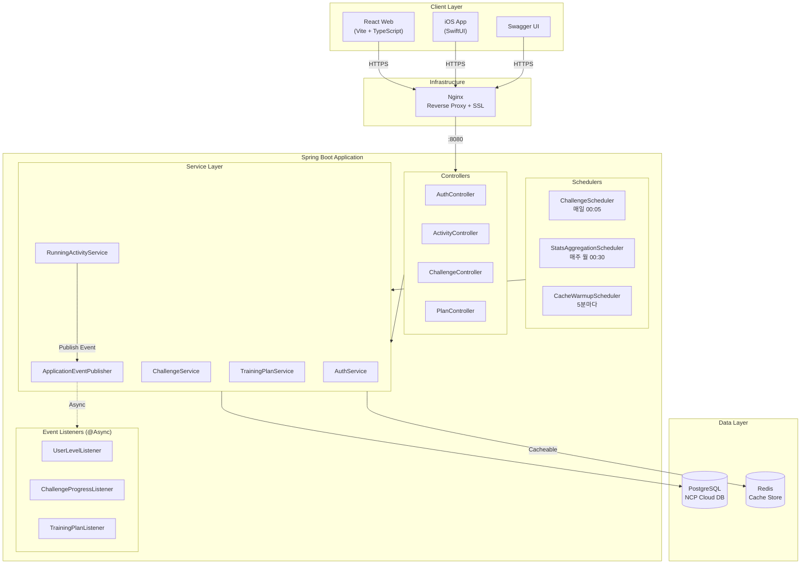
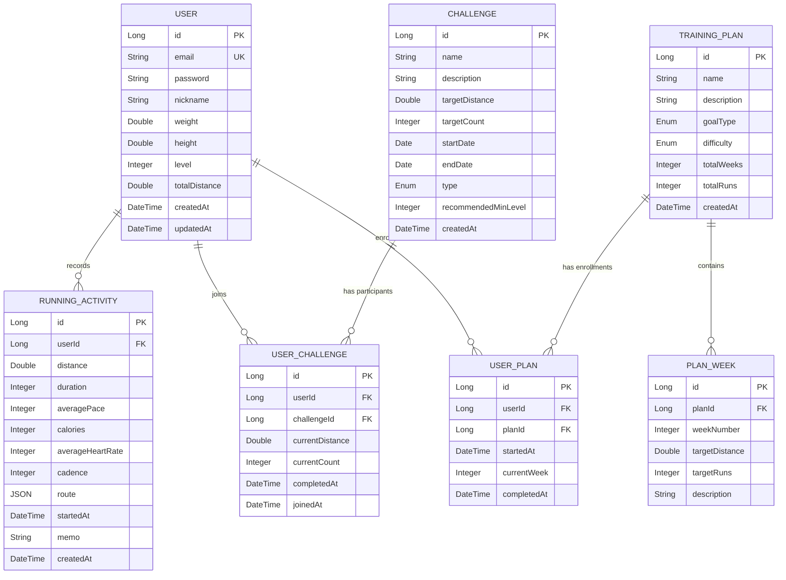
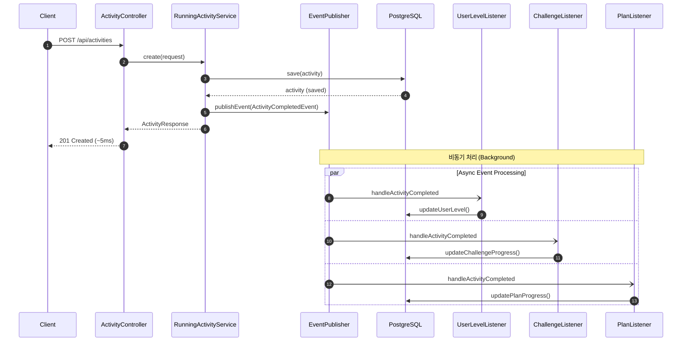
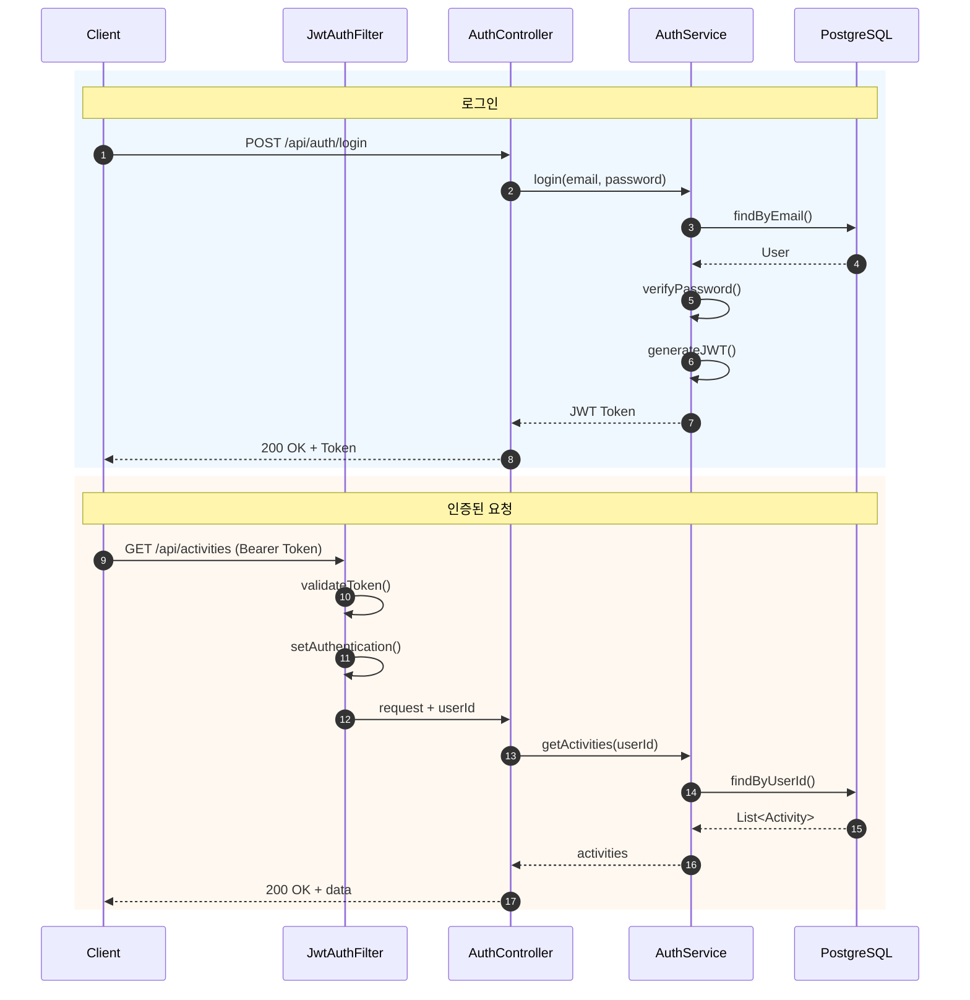

# Running App

**Nike Run Club 스타일의 풀스택 러닝 애플리케이션**

[](https://spring.io/projects/spring-boot)
[](https://openjdk.org/)
[](https://react.dev/)
[](https://developer.apple.com/xcode/swiftui/)
[](https://redis.io/)
[](Dockerfile)
[](https://github.com/jinhyuk9714/Running_App/actions)
[](#6-테스트-커버리지)

> 러닝 활동 기록, 챌린지 참여, 트레이닝 플랜 관리를 제공하는 애플리케이션입니다.
> 이벤트 기반 비동기 아키텍처와 Redis 캐싱으로 **응답시간 30% 개선**을 달성했습니다.

---

## Live Demo

| 서비스 | URL |
|--------|-----|
| **메인 페이지** | https://jinhyuk-portfolio1.shop |
| **Swagger UI** | https://jinhyuk-portfolio1.shop/swagger-ui/index.html |
| **Health Check** | https://jinhyuk-portfolio1.shop/actuator/health |
| **Prometheus Metrics** | https://jinhyuk-portfolio1.shop/actuator/prometheus |

---

## 주요 특징

- **이벤트 기반 아키텍처** - 서비스 간 느슨한 결합, 독립적 확장 가능
- **Redis 캐싱** - 조회 API 응답시간 70~86% 단축
- **K6 부하 테스트** - 100 VUs 기준 **처리량 29% 증가** 달성
- **Prometheus 메트릭** - JVM, API, 비즈니스 메트릭 실시간 모니터링
- **실서비스 배포** - NCP 클라우드, HTTPS, CI/CD 파이프라인

---

## 기술 스택

### Backend
| 기술 | 용도 |
|-----|------|
| Spring Boot 3.3 | REST API 프레임워크 |
| Spring Security + JWT | 인증/인가 |
| Spring Data JPA | ORM, 데이터 접근 |
| Spring Data Redis | 캐싱 (응답시간 30% 개선) |
| Spring Events | 이벤트 기반 비동기 처리 |
| Spring Retry | 장애 시 자동 재시도 |
| PostgreSQL / H2 | 프로덕션 / 개발 DB |

### Frontend & Mobile
| 기술 | 용도 |
|-----|------|
| React 18 + TypeScript | 웹 프론트엔드 |
| Vite + Tailwind CSS | 빌드 도구, 스타일링 |
| SwiftUI | iOS 네이티브 앱 |
| HealthKit + CoreLocation | 심박수, GPS 트래킹 |

### DevOps & Monitoring
| 기술 | 용도 |
|-----|------|
| NCP (Naver Cloud) | 클라우드 인프라 |
| Nginx + Let's Encrypt | 리버스 프록시, HTTPS |
| GitHub Actions | CI/CD 파이프라인 |
| Docker | 컨테이너화 (Alpine, Layered JAR) |
| K6 | 부하 테스트 |
| Prometheus + Micrometer | 메트릭 수집 및 모니터링 |
| Bucket4j | Rate Limiting (Token Bucket) |

---

## 시스템 아키텍처

<details>
<summary>아키텍처 다이어그램 보기</summary>



</details>

---

## ERD (Entity Relationship Diagram)

<details>
<summary>ERD 다이어그램 보기</summary>



</details>

---

## 시퀀스 다이어그램

<details>
<summary>활동 저장 (이벤트 기반 비동기 처리)</summary>



</details>

<details>
<summary>인증 흐름 (JWT)</summary>



</details>

---

## 성능 최적화

11단계에 걸쳐 백엔드 성능을 최적화했습니다. K6 부하 테스트(100 VUs)로 측정했습니다.

### 전체 성능 개선 요약

| 지표 | Baseline | 최종 | 개선율 |
|-----|----------|------|--------|
| **처리량 (TPS)** | 69.88 req/s | 90.16 req/s | **+29%** |
| 평균 응답시간 | 15.67ms | 14.97ms | -4.5% |
| P95 응답시간 | 75.36ms | 71.77ms | -4.8% |
| 에러율 | 0.00% | 0.00% | 안정적 |
| POST /activities | ~100ms | ~5ms | **-95%** |
| N+1 쿼리 (5개 조회 시) | 6개 | 1개 | **-83%** |

---

### 1. Redis 캐싱

자주 조회되는 데이터에 `@Cacheable` 적용으로 **응답시간 70~86% 단축**

| 캐시 키 | TTL | 대상 |
|--------|-----|------|
| activitySummary | 5분 | 주간/월간 요약 |
| activeChallenges | 10분 | 진행중인 챌린지 |
| plans | 30분 | 플랜 목록 |

| Endpoint | Before | After | 개선율 |
|----------|--------|-------|--------|
| GET /activities/summary | 7.43ms | 1.01ms | **-86.4%** |
| GET /challenges | 4.34ms | 1.16ms | **-73.3%** |
| GET /plans | 3.87ms | 1.18ms | **-69.5%** |

---

### 2. 이벤트 기반 비동기 아키텍처

활동 저장 시 후처리(레벨/챌린지/플랜 업데이트)를 비동기로 분리하여 **응답시간 95% 단축**

<details>
<summary>Before/After 비교</summary>

```
Before (동기) ~100ms
POST /activities → Save → Level Update → Challenge Update → Plan Update → Response

After (비동기) ~5ms
POST /activities → Save → Publish Event → Response
                              ↓ (async)
                   Level/Challenge/Plan Listeners
```

</details>

| 지표 | Before | After |
|------|--------|-------|
| POST /activities 응답시간 | ~100ms | **~5ms** |
| 서비스 결합도 | 강결합 | **느슨한 결합** |

- `@Async` + `@TransactionalEventListener`로 비동기 처리
- `@Retryable`로 일시적 실패 자동 재시도 (3회)
- 리스너 추가만으로 새 기능 확장 가능

---

### 3. N+1 쿼리 최적화

JPA Lazy Loading으로 인한 N+1 문제를 **JOIN FETCH**와 **배치 쿼리**로 해결

```java
// Before - N+1 발생: 챌린지 5개 조회 시 6개 쿼리 실행
List<UserChallenge> findByUserIdOrderByJoinedAtDesc(Long userId);

// After - JOIN FETCH로 1개 쿼리
@Query("SELECT uc FROM UserChallenge uc JOIN FETCH uc.challenge WHERE uc.user.id = :userId")
List<UserChallenge> findByUserIdWithChallenge(@Param("userId") Long userId);
```

| API | Before 쿼리 | After 쿼리 | 감소율 |
|-----|------------|-----------|--------|
| GET /challenges/my | 1 + N | **1** | **83%** |
| GET /challenges/recommended | 1 + N | **2** | **71%** |
| GET /plans/my | 1 + N | **1** | **83%** |

---

### 4. 데이터베이스 인덱스 최적화

WHERE, ORDER BY, JOIN 조건에 맞는 **복합 인덱스 11개** 추가

| 테이블 | 인덱스 | 용도 |
|--------|--------|------|
| running_activities | (user_id, started_at DESC) | 활동 목록 페이징 |
| running_activities | (started_at) | 기간별 통계 집계 |
| user_challenges | (user_id, challenge_id) UNIQUE | 중복 체크 |
| user_challenges | (user_id, completed_at) | 활성 챌린지 필터 |
| challenges | (start_date, end_date) | 진행중 챌린지 조회 |

```sql
-- 복합 인덱스 설계: 등호 조건 먼저 → 정렬 조건 나중
CREATE INDEX idx_activities_user_started ON running_activities(user_id, started_at DESC);
```

---

### 5. 테스트 커버리지

**JaCoCo**를 통한 테스트 커버리지 측정 (총 90개 테스트)

| 레이어 | 커버리지 |
|--------|----------|
| Controller | 95% |
| Service | 82% |
| Domain | 76% |
| **전체** | **62%** |

```bash
./gradlew test jacocoTestReport
# 리포트: build/reports/jacoco/test/html/index.html
```

---

### 6. Docker 이미지 최적화

멀티스테이지 빌드와 Alpine 이미지로 **이미지 크기 47% 감소**

| 항목 | Before | After | 감소율 |
|------|--------|-------|--------|
| 베이스 (JRE) | 274MB (jammy) | 146MB (alpine) | **-47%** |
| 최종 이미지 | ~350MB | ~220MB | **-37%** |

- Layered JAR로 빌드 캐시 효율화
- JVM 컨테이너 최적화 (`MaxRAMPercentage=75%`, G1GC)

---

### 7. CI/CD 파이프라인 최적화

GitHub Actions 워크플로우 개선

```
┌─────────────────┐  ┌─────────────────┐
│  build-backend  │  │ build-frontend  │   ← 병렬 실행
└────────┬────────┘  └────────┬────────┘
         ▼                    ▼
┌─────────────────────────────────────┐
│              deploy                 │   ← main 브랜치만
└─────────────────────────────────────┘
```

- Gradle 캐시로 의존성 재사용
- 테스트 병렬 실행
- PR 자동 커버리지 리포트

---

### 8. Rate Limiting

**Bucket4j** 기반 Token Bucket 알고리즘으로 API 요청 제한

| 엔드포인트 | 제한 | 용도 |
|-----------|------|------|
| POST /api/auth/login | **10회/분** | 브루트포스 방지 |
| POST /api/auth/signup | **5회/시간** | 스팸 계정 방지 |
| 기타 API | **100회/분** | 일반 사용 |

```
HTTP 429 Too Many Requests
X-Rate-Limit-Remaining: 0
X-Rate-Limit-Retry-After-Seconds: 30
```

---

### 9. 구조화된 로깅

**Logstash Logback Encoder**로 JSON 형식 로그 출력 (ELK 연동 가능)

| 환경 | 포맷 | 용도 |
|------|------|------|
| local/test | 컬러 콘솔 | 개발 편의성 |
| prod/docker | **JSON** | ELK 연동 |

```json
{
  "@timestamp": "2024-01-01T12:00:00.000+09:00",
  "level": "INFO",
  "message": "로그인 성공",
  "userId": 123,
  "requestId": "abc12345",
  "clientIp": "192.168.1.1",
  "duration": 45
}
```

---

### 10. K6 부하 테스트 비교

최적화 전후 성능을 K6 부하 테스트로 측정하여 **처리량 29% 증가** 달성

| 지표 | Baseline | Optimized | 개선 |
|------|----------|-----------|------|
| **처리량 (TPS)** | 69.88 req/s | **90.16 req/s** | +29% |
| 평균 응답시간 | 15.67ms | 14.97ms | -4.5% |
| P95 응답시간 | 75.36ms | 71.77ms | -4.8% |
| 최대 응답시간 | 129.58ms | 110.59ms | -14.7% |

---

### 11. Prometheus + Micrometer 메트릭

실시간 모니터링을 위한 Prometheus 메트릭 구현

| 카테고리 | 메트릭 | 설명 |
|---------|--------|------|
| JVM | `jvm_memory_used_bytes` | 힙 메모리 사용량 |
| HTTP | `http_server_requests_seconds` | API 응답 시간 |
| 비즈니스 | `runningapp_users_signup_total` | 회원가입 수 |
| 캐시 | `cache_gets_total{result=hit/miss}` | 캐시 히트율 |

```bash
curl https://jinhyuk-portfolio1.shop/actuator/prometheus | grep runningapp
```

---

## 실행 방법

### Backend

```bash
./gradlew build      # 빌드 및 테스트
./gradlew bootRun    # 실행 (H2 인메모리 DB)
```

| URL | 설명 |
|-----|------|
| http://localhost:8080/swagger-ui | API 문서 |
| http://localhost:8080/h2-console | DB 콘솔 |

### Frontend

```bash
cd frontend
npm install
npm run dev    # http://localhost:3000
```

### iOS

```bash
open ios/RunningApp/RunningApp.xcodeproj
# Xcode에서 Cmd+R로 실행
```

### Docker

```bash
docker-compose up --build
```

### 부하 테스트

```bash
k6 run k6/quick-test.js      # 1분 테스트
k6 run k6/load-test.js       # 3분 30초 테스트
```

---

## API 엔드포인트

### 인증
| Method | Endpoint | 설명 |
|--------|----------|------|
| POST | /api/auth/signup | 회원가입 |
| POST | /api/auth/login | 로그인 (JWT 발급) |
| GET | /api/auth/me | 내 정보 조회 |
| PATCH | /api/auth/me | 프로필 수정 |

### 러닝 활동
| Method | Endpoint | 설명 |
|--------|----------|------|
| POST | /api/activities | 활동 저장 |
| GET | /api/activities | 목록 조회 (페이징) |
| GET | /api/activities/{id} | 상세 조회 |
| PUT | /api/activities/{id} | 수정 |
| DELETE | /api/activities/{id} | 삭제 |
| GET | /api/activities/summary | 주간/월간 요약 |
| GET | /api/activities/stats | 통계 |

### 챌린지
| Method | Endpoint | 설명 |
|--------|----------|------|
| GET | /api/challenges | 진행중인 챌린지 |
| GET | /api/challenges/recommended | 추천 챌린지 |
| POST | /api/challenges/{id}/join | 참여 |
| GET | /api/challenges/my | 내 챌린지 |

### 트레이닝 플랜
| Method | Endpoint | 설명 |
|--------|----------|------|
| GET | /api/plans | 플랜 목록 |
| GET | /api/plans/recommended | 추천 플랜 |
| POST | /api/plans/{id}/start | 시작 |
| GET | /api/plans/my | 내 플랜 |
| GET | /api/plans/{id}/schedule | 주차별 스케줄 |

---

## 프로젝트 구조

```
Running_App/
├── src/main/java/com/runningapp/
│   ├── config/          # Security, Async, Cache 설정
│   ├── controller/      # REST API 엔드포인트
│   ├── service/         # 비즈니스 로직
│   ├── repository/      # 데이터 접근 계층
│   ├── domain/          # JPA 엔티티
│   ├── dto/             # 요청/응답 DTO
│   ├── event/           # 이벤트 클래스 및 리스너
│   ├── scheduler/       # 스케줄러 (만료 처리, 통계 집계)
│   ├── security/        # JWT 필터, 인증 처리
│   └── exception/       # 전역 예외 처리
│
├── frontend/            # React + TypeScript 웹 앱
├── ios/                 # SwiftUI iOS 앱
├── k6/                  # 부하 테스트 스크립트
├── deploy/              # 배포 설정 (Grafana, Nginx)
└── docs/                # 문서
```

---

## 문서

| 문서 | 설명 |
|------|------|
| [PERFORMANCE.md](docs/PERFORMANCE.md) | 성능 최적화 상세 |
| [PERFORMANCE-COMPARISON.md](docs/PERFORMANCE-COMPARISON.md) | K6 부하 테스트 비교 |
| [DEPLOY_NCP.md](docs/DEPLOY_NCP.md) | NCP 배포 가이드 |
| [HTTPS_SETUP.md](docs/HTTPS_SETUP.md) | Nginx + Let's Encrypt 설정 |

---

## 주요 기능

### 레벨 시스템
- 누적 거리 기반 Lv.1 ~ Lv.10 자동 산정
- 활동 저장/수정/삭제 시 비동기로 레벨 업데이트

### 챌린지
- 거리/횟수 목표 챌린지 (6종)
- 사용자 레벨 기반 추천
- 활동 저장 시 자동 진행률 업데이트
- 스케줄러로 만료 챌린지 자동 처리

### 트레이닝 플랜
- 5K / 10K / 하프마라톤 목표
- 초급 / 중급 / 고급 난이도 (총 9종)
- 주차별 목표 달성 시 자동 진행

### iOS 앱
- 실시간 GPS 트래킹 + 지도 경로 표시
- HealthKit 연동 (심박수, 케이던스, 걸음수)
- 서버 연동 활동 저장
